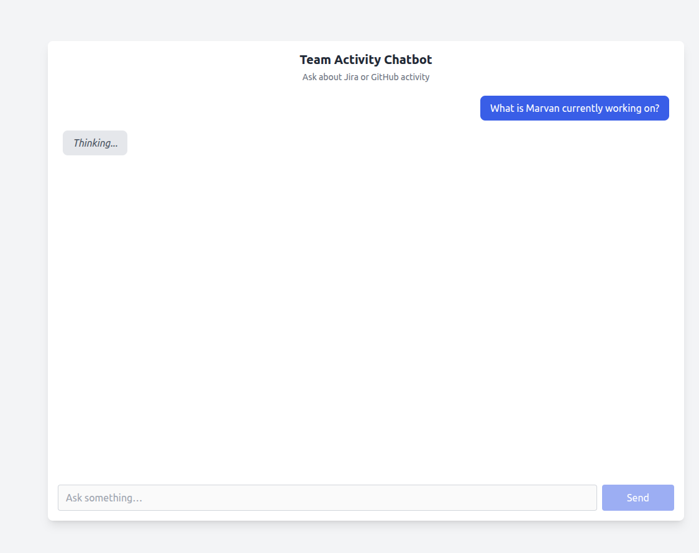
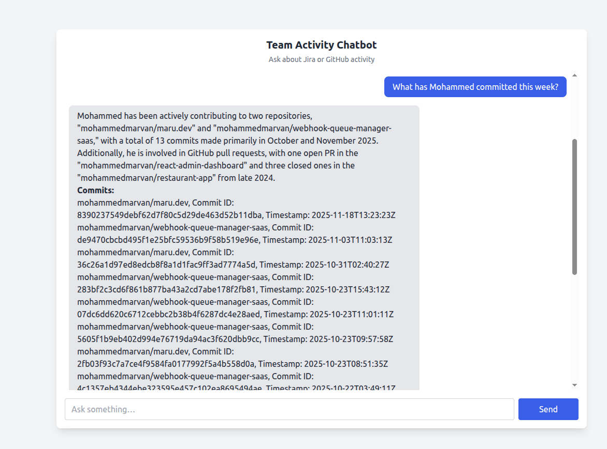
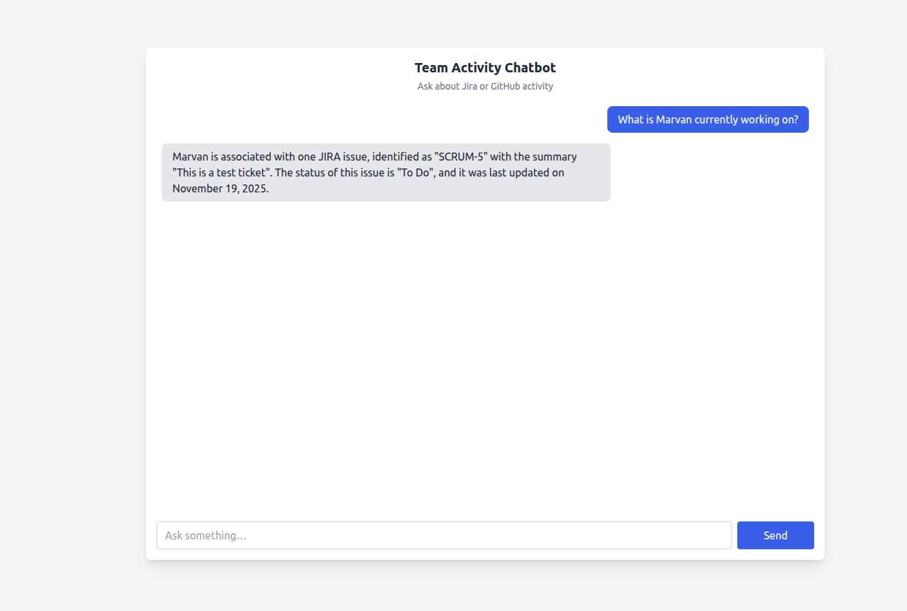
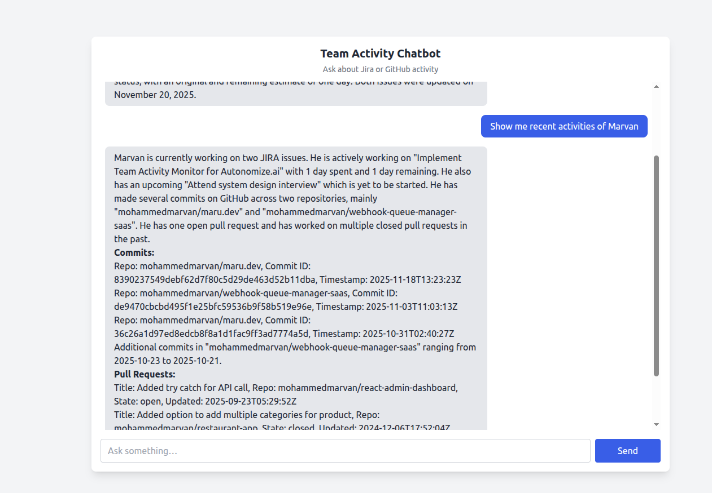
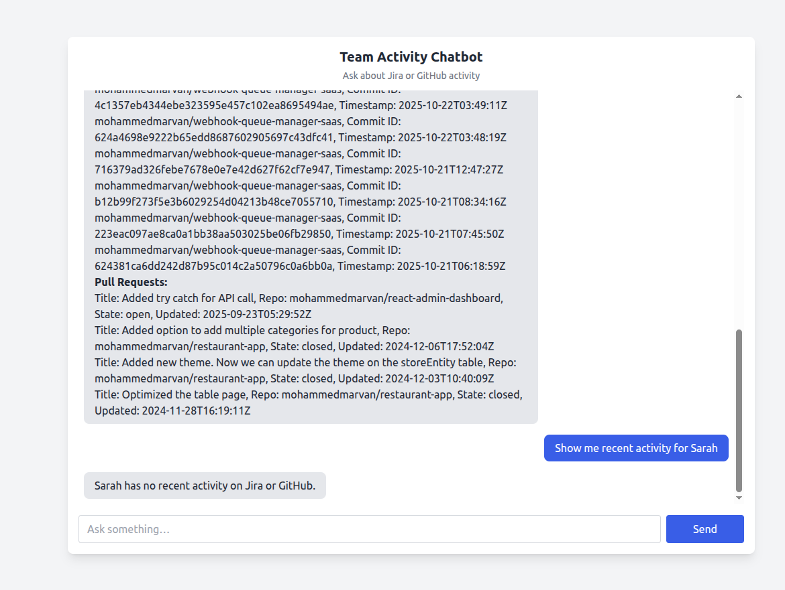
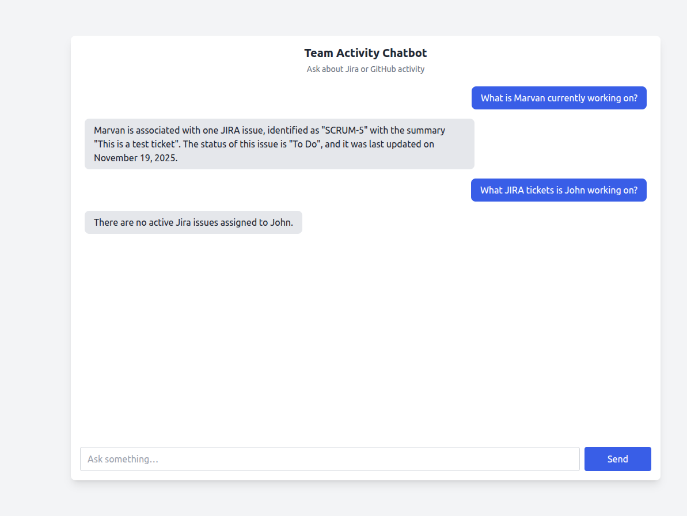
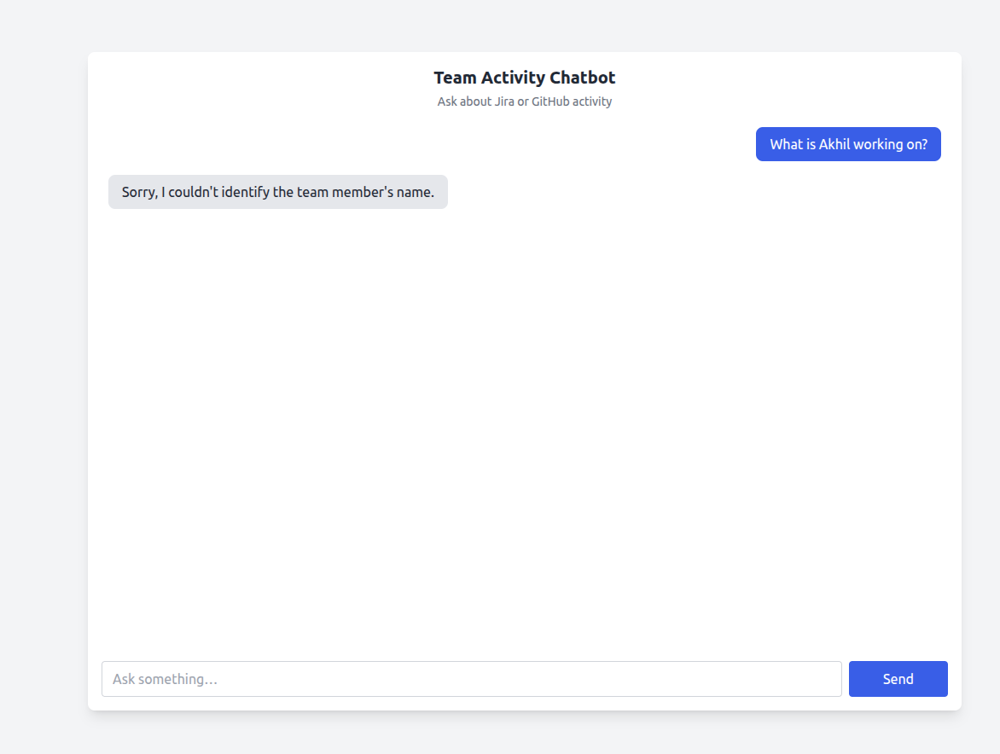

# Team Activity Monitor

Team Activity Monitor is a lightweight Express + browser UI that lets you ask about Jira issues and GitHub commits/pull requests for mapped teammates. The service proxies Jira, GitHub, and OpenAI, then renders responses in a chat-style interface.

## Requirements

- Node.js 22.x (use `nvm install 22 && nvm use 22` or your preferred manager)
- npm 10+ (bundled with Node 22)

## Installation

1. Clone this repository and switch into the project directory:

   ```bash
   git clone git@github.com:mohammedmarvan/team-activity-monitor.git
   cd team-activity-monitor
   ```

2. Install dependencies:
   ```bash
   npm install
   ```
3. (Optional) Run formatting/linting to ensure a clean workspace:
   ```bash
   npm run format
   ```

## Start Setup

- Development with auto-reload:
  ```bash
  npm run dev
  ```
- Production-style run:
  ```bash
  npm start
  ```
  Both commands boot `src/main.js`, which serves the API and the static frontend. Logs are written via `winston` to `logs/app.log`.

## Environment Variables

### 1. env-example file

Use the following template for your environment variables (save it as `.env.example` for the team and copy to `.env` locally):

```
JIRA_BASE_URL=https://your-domain.atlassian.net
JIRA_EMAIL=team-member@example.com
JIRA_API_TOKEN=atlassian-api-token
GITHUB_TOKEN=ghp_yourGitHubToken
OPENAI_API_KEY=sk-yourOpenAIKey

# Optional overrides
PORT=3000
```

### 2. Updating your `.env`

1. Copy the example file: `cp .env.example .env`.
2. Fill in real credentials:
   - `JIRA_BASE_URL`, `JIRA_EMAIL`, `JIRA_API_TOKEN`: used by `config/config.js` to fetch Jira issues.
   - `GITHUB_TOKEN`: enables GitHub commit/PR lookups.
   - `OPENAI_API_KEY`: powers drafted responses.
3. Never commit `.env`; it is already covered by `.gitignore`.

### 3. Configuring the port

- The server defaults to port `3000`. Override it by setting `PORT` in your `.env`.
- Ensure the chosen port is free or update reverse proxies accordingly.

### 4. Team Member Mapping

For security reasons, real Jira/GitHub user identifiers are not stored in the repository.

To configure your own team mapping:

1. Copy the sample file:

   ```
   cp src/config/teamMap.sample.js src/config/teamMap.private.js
   ```

2. Replace the sample data with your real Jira/GitHub IDs.
3. `teamMap.private.js` is automatically excluded from Git and loaded at runtime.

## Checking the Interface

1. Start the server (`npm run dev` or `npm start`).
2. Open your browser to `http://localhost:<PORT>` (defaults to `http://localhost:3000`).
3. Enter a natural-language query such as "Show GitHub activity for Marvan this week".
4. The chat window displays:
   - Your prompt bubbles on the right.
   - Formatted Jira/GitHub summaries on the left (parsed via `marked` for Markdown).
5. Monitor `logs/app.log` (or the terminal) for request/response traces if troubleshooting.

## Testing

The project includes a comprehensive test suite using Jest. Tests are located in the `__tests__` directory.

### Running Tests

Run all tests:

```bash
npm test
```

Run tests in watch mode (automatically re-runs on file changes):

```bash
npm run test:watch
```

Run tests with coverage report:

```bash
npm run test:coverage
```

### Test Structure

Tests are organized in the `__tests__` directory:

- `__tests__/services/` - Tests for service modules (query-parser, github-client, jira-client)
- `__tests__/controllers/` - Tests for controller modules (askController)

### Test Coverage

The test suite covers:

- **Query Parsing**: Intent detection (Jira, GitHub, both) and name extraction
- **GitHub Client**: Commit fetching, PR fetching, and error handling
- **Jira Client**: Issue fetching and formatting
- **Ask Controller**: Request handling, team member mapping, and response generation

### Writing New Tests

When adding new features, ensure you:

1. Create test files in the appropriate `__tests__` subdirectory
2. Follow the naming convention: `*.test.js`
3. Mock external dependencies (APIs, config files) using Jest mocks
4. Test both success and error scenarios

## Workflow & Usage

The Team Activity Monitor provides an intuitive chat interface to query team member activity. Here's how it works:

### Getting Started

Once the server is running, you'll see the chat interface. Simply type your question in natural language about any team member's activity.

### Example Queries

- "What is Marvan's GitHub activity?"
- "Show me Jira issues for Abhishek"
- "What has Mohammed been working on?"

### Workflow Screenshots

#### 1. Loading State

When you submit a query, the system shows a loading indicator while fetching data from Jira and/or GitHub:



#### 2. GitHub Activity Summary

When querying GitHub activity, you'll see a detailed summary of commits and pull requests:



#### 3. Jira Activity Summary

For Jira queries, the system displays active issues assigned to the team member:



#### 4. Combined Activity Summary

When querying both platforms or general activity, you'll get a comprehensive overview:



#### 5. No Activity Found

If a team member has no recent activity, the system will inform you:



#### 6. No Jira Found

If the system cannot find any activity on the Jira:



#### 7. No User Found

If the system cannot identify the team member from your query:



### How It Works

1. **Query Parsing**: Your natural language query is parsed to extract the team member's name and intent (Jira, GitHub, or both).
2. **Data Fetching**: The system queries the appropriate APIs (Jira, GitHub) based on the intent.
3. **Response Generation**: Using OpenAI, the system generates a human-readable summary of the activity.
4. **Display**: The formatted response is displayed in the chat interface with proper Markdown rendering.

With the environment configured and the server running, you can now monitor teammate activity across Jira and GitHub in one place.
